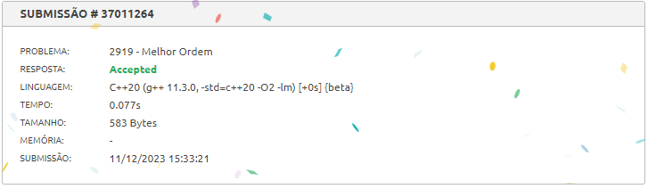

# PD_QuestoesJuizs

- **Número da dupla**: 29
- **Conteúdo da Disciplina**: Programação Dinâmica

## Alunos
| Matrícula  | Aluno                   |
| ---------- | ----------------------- |
| 18/0102761 | Jefferson França Santos |
| 20/0049879 |  Yago Milagres Passos   |

## Sobre 
Exercícios do [Beecrowd](https://www.beecrowd.com.br) com nível 5 ou mais.
  
Exercícios escolhidos:

- : .

- : 
.

- [Melhor Ordem - 2919](https://www.beecrowd.com.br/repository/UOJ_2919.html): O desafio consiste em criar um programa que, dado uma lista de N números inteiros em Nlognônia, encontre a subsequência crescente mais longa seguindo as regras estabelecidas. O participante pode escolher NI valores da lista original e inseri-los em uma nova lista, garantindo que cada novo elemento seja maior do que todos os elementos já inseridos até o momento. O objetivo é maximizar o tamanho da nova lista, percorrendo a lista original uma única vez. Exercício de Nível 7.
  
- : .
  
## Screenshots

## Especificação
**Linguagem**: C e C++ 

## Uso 

## Vídeo

O arquivo do vídeo está disponível [aqui](./apresentacao.mp4) ou no [link do youtube](https://youtu.be/55hbgPos7u0).
