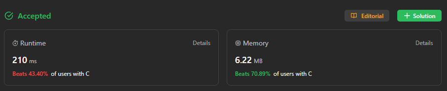
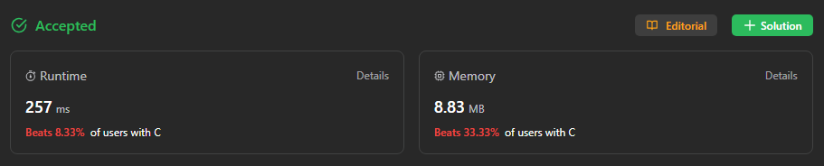

# PD_QuestoesJuizs

- **Número da dupla**: 29
- **Conteúdo da Disciplina**: Programação Dinâmica

## Alunos
| Matrícula  | Aluno                   |
| ---------- | ----------------------- |
| 18/0102761 | Jefferson França Santos |
| 20/0049879 |  Yago Milagres Passos   |

## Sobre 
Exercícios do [Beecrowd](https://www.beecrowd.com.br) de nível 7 e do [LeetCode](https://leetcode.com) com dificuldade *hard*.
  
Exercícios escolhidos:

- [10. Regular Expression Matching](https://leetcode.com/problems/regular-expression-matching/): Dada uma string de entrada s e um padrão p, implemente a correspondência de expressões regulares com suporte para '.' (ponto), que corresponde a qualquer caractere único, e '*' (asterisco), que corresponde a zero ou mais ocorrências do elemento precedente. A correspondência deve abranger a string de entrada inteira (não parcial).

- [312. Burst Balloons](https://leetcode.com/problems/burst-balloons/description/): Você recebe n balões, indexados de 0 a n - 1. Cada balão é pintado com um número representado por um array nums. Você é solicitado a estourar todos os balões.
Se você estourar o balão de índice i, você receberá moedas equivalentes a nums[i - 1] * nums[i] * nums[i + 1]. Se i - 1 ou i + 1 estiver fora dos limites do array, trate como se houvesse um balão com o número 1 pintado nele.
Retorne o máximo de moedas que você pode coletar estourando os balões de maneira sábia.

- [Melhor Ordem - 2919](https://www.beecrowd.com.br/repository/UOJ_2919.html): O desafio consiste em criar um programa que, dado uma lista de N números inteiros em Nlognônia, encontre a subsequência crescente mais longa seguindo as regras estabelecidas. O participante pode escolher NI valores da lista original e inseri-los em uma nova lista, garantindo que cada novo elemento seja maior do que todos os elementos já inseridos até o momento. O objetivo é maximizar o tamanho da nova lista, percorrendo a lista original uma única vez. Exercício de Nível 7.

  
## Screenshots

## Especificação
**Linguagem**: C e C++ 

## Uso 

Para rodar os códigos, basta abrir os links a cima, e colar os códigos dos arquivos presentes nesse repositório. Ou, se preferir rodar na própria máquina e testar entradas, instale um [compilador c](https://gcc.gnu.org/install/download.html) de sua preferência e rode de acordo com o compilador. Também há a possibilidade de utilizar um [compilador online](https://www.onlinegdb.com/online_c_compiler) para facilitar o processo.

## Vídeo

O arquivo do vídeo está disponível [aqui](./apresentacao.mp4) ou no [link do youtube](https://youtu.be/nVbDU7PUHWg).
